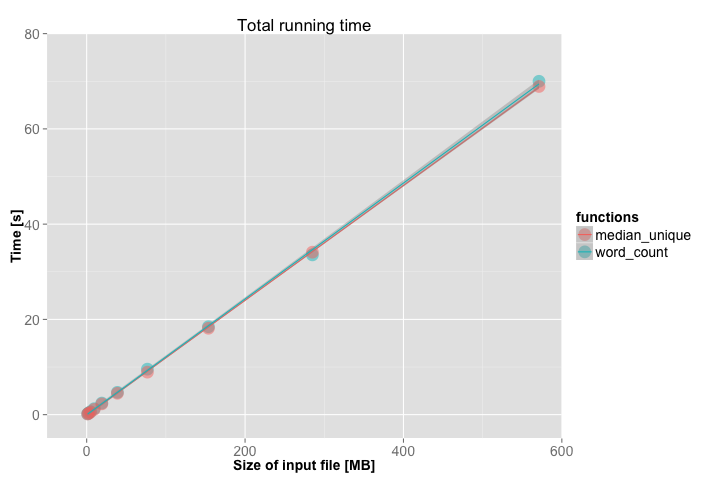

Coding Challenge
===========================================================

For this coding challenge, a few functions were developed to help analyze the community of Twitter users.  For simplicity, the features are primitive. The functions here should also work with ordinary text file.

## Challenge Summary
This challenge is to implement two features:

1. Calculate the total number of times each word has been tweeted.
2. Calculate the median number of *unique* words per tweet, and update this median as tweets come in.

For example, suppose the following three tweets come in, one after the other:

- WORKING!!! Lots of paperwork and website has to be up this wkRT @blessedlife1: @ChefAmeera wow you are up late what's going on in you world
- Perfect! That's a compliment to the Chef! Love ya? RT @krysivory: @ChefAmeera xxoxox! FYI...I ate ALLLLL of the strawberry's...LOL!
- @therealkandeman Can you take time out 1 evening to come to a birthday dinner for little ole me?

The first feature produces the following total count for each word:

```
1                                  1
@ChefAmeera                        2
@blessedlife1:                     1
@krysivory:                        1
@therealkandeman                   1
ALLLLL                             1
Can                                1
Chef!                              1
FYI...I                            1
Lots                               1
Love                               1
Perfect!                           1
RT                                 1
That's                             1
WORKING!!!                         1
a                                  2
and                                1
are                                1
ate                                1
be                                 1
birthday                           1
come                               1
compliment                         1
dinner                             1
evening                            1
for                                1
going                              1
has                                1
in                                 1
late                               1
little                             1
me?                                1
of                                 2
ole                                1
on                                 1
out                                1
paperwork                          1
strawberry's...LOL!                1
take                               1
the                                2
this                               1
time                               1
to                                 4
up                                 2
website                            1
what's                             1
wkRT                               1
world                              1
wow                                1
xxoxox!                            1
ya?                                1
you                                3
```

For the second feature, the number of unique words in each tweet is 23, 18, and 16 (since the words 'you' and 'up' appear twice in the first tweet, 'the' appears twice in the second tweet, and 'to' appear twice in the third tweet).  This means that the set of unique words per tweet is {23} after the first tweet arrives, is {23, 18} after the second tweet arrives, and is {23, 18, 16} after all three tweets arrive.  Thus, the second feature would produce the following output:

```
23.00 
20.50 
18.00 
```

Recall that the median of a set with an even number of items is the mean of the two middle elements (e.g. the median of {23, 18} is 20.50). In this challenge a few assumptions have been made to make things simpler:
- Each tweet only contains lowercase letters, numbers, and ASCII characters like ':', '@', and '#'.
- A word is defined as anything separated by whitespace. 

The output of the first feature is also outputted in order, according to the [ASCII Code](http://www.ascii-code.com).   

## Details of Implementation

The program output the results of the first feature to a text file named `ft1.txt` in a directory named `tweet_output`.

A assumption has been made that that each new line of the text file corresponds to a new tweet. The program outputs the results of the second feature to a text file named `ft2.txt` in the `tweet_output` directory.

The program is written in Python, with only `time`, `sys`, and `heapq` module imported. The `time` module is used to estimate the run time of each program, and `heapq` module is used to calcualte median for the second feature.

The program has been tested with data of different sizes to show that it scales for large amounts of data. The largest data set was 571MB, with approximately 5,150,000 tweets. The following figure shows the run time for the two functions.



The `tweet_input` directory contains two test data sets. However, both of them are very small (5KB and 341 bytes). 
The `run.sh` loads the `tweets_test_data.txt` from `tweet_input`, feeds the data to both programs, and writes the result into `ft1.txt` and `ft2.txt` in the `tweet_output` directory.
